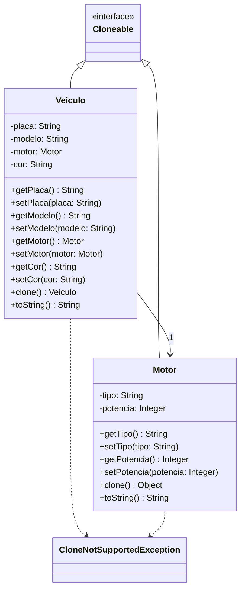

# Diagrama UML: Prototype (Veículo e Motor)

```mermaid
classDiagram
    class Cloneable {
        <<interface>>
    }

    class Veiculo {
        -placa: String
        -modelo: String
        -motor: Motor
        -cor: String
        +getPlaca() String
        +setPlaca(placa: String)
        +getModelo() String
        +setModelo(modelo: String)
        +getMotor() Motor
        +setMotor(motor: Motor)
        +getCor() String
        +setCor(cor: String)
        +clone() Veiculo
        +toString() String
    }

    class Motor {
        -tipo: String
        -potencia: Integer
        +getTipo() String
        +setTipo(tipo: String)
        +getPotencia() Integer
        +setPotencia(potencia: Integer)
        +clone() Object
        +toString() String
    }

    class CloneNotSupportedException

    Cloneable <|-- Veiculo
    Cloneable <|-- Motor

    Veiculo --> Motor : 1

    Veiculo ..> CloneNotSupportedException
    Motor ..> CloneNotSupportedException
```
